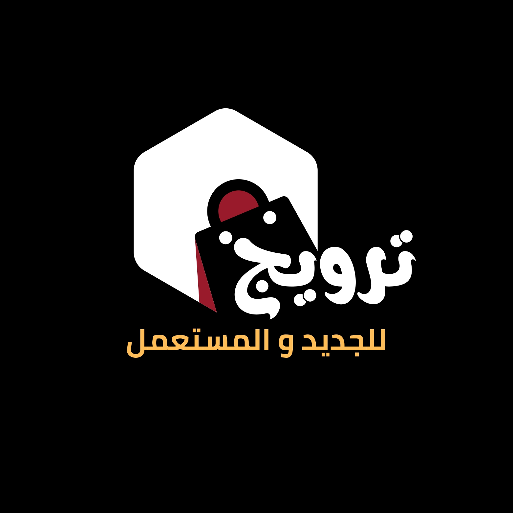

# 🏜️ Tarwij Market

**سوق إلكتروني بسيط ومجاني لبيع وشراء المنتجات الجديدة والمستعملة في الصحراء، موريتانيا، وجزر الكناري.**

منصة محلية تهدف إلى دعم التجارة الفردية والمجتمعية، عبر واجهة أنيقة ومتجاوبة تتيح للزوار:
- 🗺️ استعراض خريطة تفاعلية للمنطقة
- 📦 إرسال منتجاتهم مباشرة عبر واتساب
- 🤝 التواصل بسهولة مع صاحب السوق

---

## ✨ الميزات

- ✅ **تصميم متجاوب** يعمل بسلاسة على الجوال والكمبيوتر
- 🗺️ **خريطة مدمجة** للصحراء، موريتانيا، وجزر الكناري
- 📋 **نموذج إرسال منتج** بسيط وسريع
- 📲 **إرسال مباشر إلى واتساب** صاحب السوق
- 🌐 **دعم اللغة العربية** واتجاه RTL بالكامل
- 🧭 **واجهة سهلة الاستخدام** بدون تسجيل دخول أو تعقيدات

---

## 📦 طريقة الاستخدام

1. افتح الموقع على [tarwij.github.io](https://tarwij.github.io)
2. استعرض الخريطة التفاعلية
3. املأ النموذج بمعلومات المنتج (الاسم، السعر، الوصف، رقم التواصل)
4. اضغط "إرسال عبر واتساب" وسيتم فتح محادثة مباشرة مع صاحب السوق

---

## 🛠️ التقنيات المستخدمة

| التقنية | الاستخدام |
|---------|------------|
| **HTML5** | بناء الهيكل العام |
| **CSS3** | تصميم متجاوب وأنيق |
| **Icons8** | أيقونات التواصل |
| **Wikipedia Map Embed** | خريطة المنطقة |
| **WhatsApp API** | إرسال مباشر للمنتجات |

---

## 📬 تواصل معنا

هل لديك منتج للبيع؟ أو اقتراح لتطوير السوق؟ تواصل معنا عبر المنصات التالية:

- 📱 واتساب: [اضغط هنا](https://wa.me/212600000000)
- 📧 بريد إلكتروني: [you@example.com](mailto:you@example.com)
- 📸 إنستغرام: [@tarwij.market](https://www.instagram.com/tarwij.market)
- 🎥 تيك توك: [@tarwij.market](https://www.tiktok.com/@tarwij.market)
- 👻 سناب شات: [@tarwij.market](https://www.snapchat.com/add/tarwij.market)

---

## 📄 الترخيص

هذا المشروع مفتوح المصدر ومتاح للاستخدام والتعديل بحرية تحت رخصة **MIT**.

---

> 💡 تم تطوير هذا المشروع بهدف دعم التجارة المحلية في المناطق الصحراوية بطريقة بسيطة وفعالة، مع التركيز على سهولة الوصول، التفاعل المباشر، والتصميم العصري.
